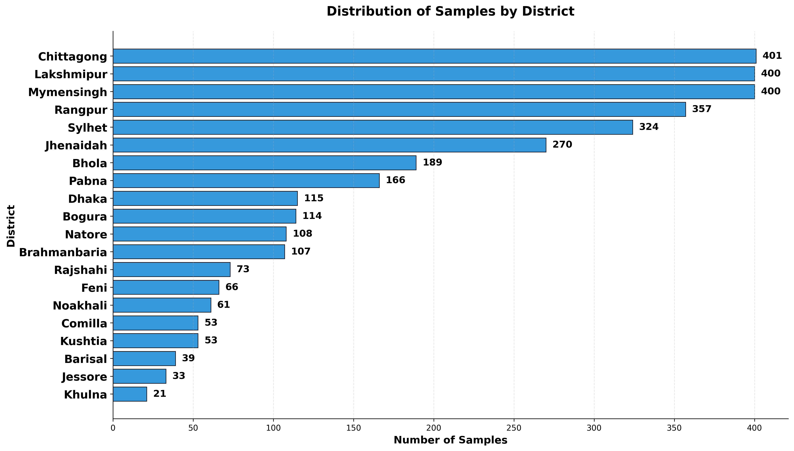
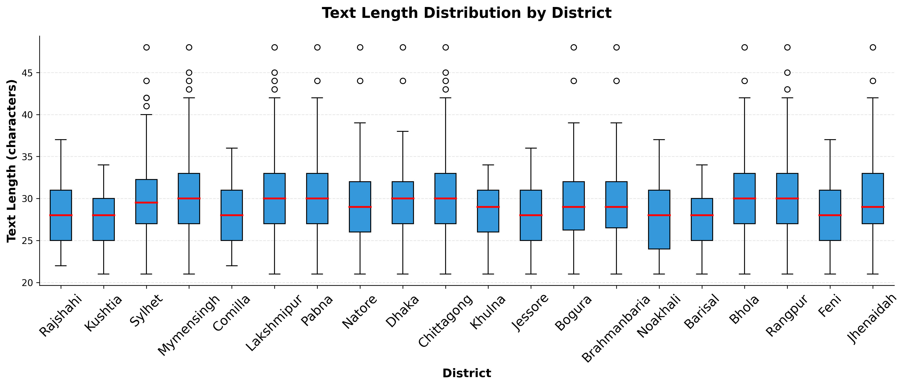
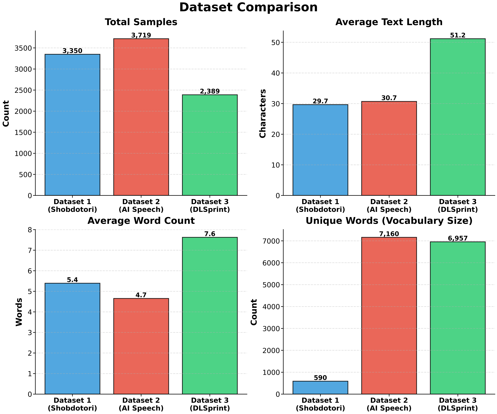
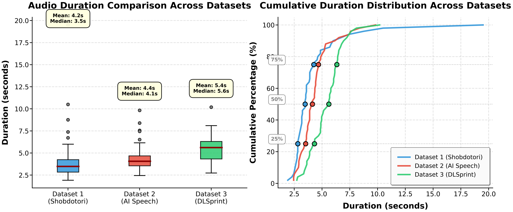

# Transcribing Regional Bangladeshi Dialects: A Dual-Stage Sequential Fine-Tuning Approach

**Team Name:** Backprop Sust  
**Competition:** AI-FICATION 2025 - Shobdotori Challenge

[](https://www.python.org/)
[](https://pytorch.org/)
[](https://github.com/openai/whisper)
[](https://huggingface.co/docs/peft/index)

## 📌 Project Overview

This repository contains the solution developed by **Team Backprop Sust** for the Shobdotori ASR challenge. The objective was to develop a robust Automatic Speech Recognition (ASR) system capable of transcribing **20 distinct regional Bangladeshi dialects** (e.g., Chittagonian, Sylheti, Rangpuri) into **Standard Formal Bangla** text.

Our solution leverages the **OpenAI Whisper Medium** architecture, optimized via a novel **Dual-Stage Sequential Fine-Tuning** strategy to handle acoustic variability and data scarcity.

### 🏆 Key Achievements
* **Public Leaderboard (NLS):** 0.91345
* **Private Leaderboard (NLS):** 0.88077

---

## 👥 Team Members

| Name | Affiliation |
| :--- | :--- |
| **Md Nasiat Hasan Fahim** | Dept of CSE, SUST (Session: 2020-21) |
| **Miftahul Alam Adib** | Dept of Statistics, SUST (Session: 2023-24) |
| **Arif Hussain** | Dept of Mathematics, SUST (Session: 2022-23) |

---

## 🧩 Problem Statement

Standard ASR models often fail on regional dialects due to "accent mismatch". Key challenges identified in the dataset included:

1.  **Extreme Class Imbalance:** As shown below, there is a significant disparity in data availability. While regions like Chittagong and Mymensingh have ~400 samples, Khulna and Jessore have fewer than 35.
2.  **Acoustic Variability:** Phonetic shifts (e.g., `/p/` $\to$ `/f/`).
3.  **Data Redundancy:** A massive amount of sentence duplication in the training set.


*Figure 1: Distribution of training samples across 20 districts, highlighting severe class imbalance.*

---

## 🛠 Methodology

Our approach follows a comprehensive pipeline from stratified data splitting to deep punctuation restoration.


*Figure 2: Complete workflow of our proposed solution.*

### 1. Model Architecture & Initialization
We utilized the **Whisper Medium (769M parameters)** model. We initialized our model using the **1st Place Solution checkpoint from the Bengali.AI Speech Recognition competition**, providing a robust foundation for Bengali acoustics.

### 2. Dual-Stage Sequential Fine-Tuning
To prevent catastrophic forgetting and adapt to the specific dialect data, we employed a two-phase training curriculum:

| Phase | Dataset Mix | Epochs | Warmup Steps | Learning Rate | Composite Score Formula |
| :--- | :--- | :--- | :--- | :--- | :--- |
| **Phase 1** | Main + DL Sprint | 10 | 100 | 1e-4 | S_final = 0.89 × WER_main + 0.11 × WER_diff |
| **Phase 2** | Main + Bengali.AI | 8 | 0 | 1e-4 | S_final = 0.95 × WER_main + 0.05 × WER_diff |

* **Adaptive Weighting:** We used composite scoring to balance the learning rate between the main dialect dataset and auxiliary datasets.
* **High-Rank LoRA:** Implemented LoRA with **Rank 1024**, Alpha 64, and Dropout 0.1, targeting `q_proj` and `v_proj`.

### 3. Data Preprocessing
* **Audio:** Resampled to 16 kHz mono; generated Log-Mel Spectrograms.
* **Text:** Normalized by removing non-speech artifacts (`<>`, `..`) and English characters.
* **Dynamic Padding:** Custom data collator for batch-level dynamic padding.

### 4. Post-Processing Pipeline
* **Inference:** Greedy Decoding (`num_beams=1`) with batch size 4 on T4 GPUs.
* **Deep Punctuation Restoration:** An ensemble of four **BERT (MuRIL-base)** models using Class-Weighted Voting [1.0, 1.4, 1.0, 0.8] to optimize standard Bengali punctuation.

---

## 📊 Dataset Analysis & Insights

We conducted a rigorous Exploratory Data Analysis (EDA) to design our training strategy.

### 1. Data Duplication & Text Length
A critical finding was the lack of linguistic diversity in the primary dataset.
* **High Duplication:** Out of **3,350 total sentences**, only **386 were unique**. Approximately 88% of the dataset consisted of duplicate sentences.
* **Text Length:** Despite the sample imbalance, the text length distribution remained relatively consistent across districts (median ~30 characters).

<p float="left">
  
   
</p>
*Figure 3: (Left) Analysis of sentence uniqueness vs. duplication. (Right) Character length boxplots per district.*

### 2. Necessity of Auxiliary Datasets
To counter the limitations of the primary Shobdotori dataset (short audio duration and low vocabulary size), we augmented it with **AI Speech** and **DL Sprint** datasets.

* **Audio Duration:** The primary dataset had a mean duration of only **4.2s**. The auxiliary datasets provided longer samples (up to ~5.4s mean), helping the model generalize to longer utterances.
* **Vocabulary:** The primary dataset only contained **590 unique words**. Adding the auxiliary datasets expanded our vocabulary to over **7,000 words**, crucial for better language modeling.


*Figure 4: Comparison of Total Samples, Text Length, Word Count, and Vocabulary Size across datasets.*


*Figure 5: Duration distribution and cumulative percentage across the three datasets.*

---

## 📈 Results

| Experiment Configuration | Public LB (NLS) | Private LB (NLS) |
| :--- | :--- | :--- |
| Baseline (Whisper Small, Static Pad) | 0.76897 | 0.71913 |
| Interim (Whisper Medium, Main Only) | 0.91664 | 0.87203 |
| **Proposed (Dual-Stage + LoRA + Post-Proc)** | **0.91345** | **0.88077** |

---

## 📜 Citation

If you find this approach useful, please cite our work:
```bibtex
@inproceedings{backpropsust2025,
  title={Transcribing Regional Bangladeshi Dialects: A Dual-Stage Sequential Fine-Tuning Approach},
  author={Fahim, Md Nasiat Hasan and Adib, Miftahul Alam and Hussain, Arif},
  booktitle={AI-FICATION 2025: Shobdotori Challenge},
  year={2025},
  organization={Shahjalal University of Science and Technology}
}
